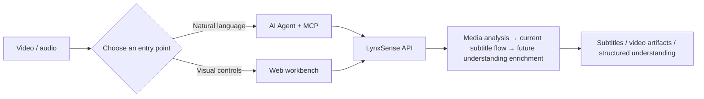

English | [简体中文](./README.md)

<div align="center">
  
  <h1>LynxSense</h1>
  <p><strong>Sense every signal in media with the acuity of a lynx.</strong></p>
  <p>Turn subtitles, categories, emotion, and vocal tone into information that can be understood, searched, and used by AI.</p>

  <p>
    <a href="#-quick-start">Quick Start</a> ·
    <a href="#-product-direction">Product Direction</a> ·
    <a href="#-mcp-integration">MCP Integration</a> ·
    <a href="#-web-workbench">Web Workbench</a> ·
    <a href="./docs/mcp-server.md">Documentation</a>
  </p>

  <p>
    
    
    
    
    
  </p>
</div>


LynxSense is a media-understanding workbench for video and audio. Its shipped subtitle pipeline covers video download, audio extraction, speech recognition, subtitle translation, and subtitle muxing. That is the starting point for understanding media, not the endpoint. The product direction is to turn text, content categories, emotion, vocal tone, and key events into structured results with time ranges and confidence, usable by people, search systems, and LLMs as dependable context.

## 🎯 Product Direction

LynxSense is intended to turn raw multimedia into a representation that can be reasoned over. Input can be video or audio; output can include subtitles and finished video today, and structured understanding results that AI agents and business systems can consume as the product evolves.

- **Subtitles and segmented text**: Keep time ranges, spoken content, and editable subtitles as a traceable base layer.
- **Content classification and tags**: Identify topics, scenes, people, or key events against configurable taxonomies to support search and downstream routing.
- **Vocal-expression understanding**: Detect emotion, tone, speaking rate, and other acoustic signals that add evidence beyond the transcript.
- **LLM-ready context**: Return structured fields, time ranges, and confidence so an LLM can locate, cite, and combine media signals instead of receiving only one long transcript.

These capabilities are product direction rather than claims of features already shipped. They will enter the Web workbench, job results, and MCP tools as they are implemented.

## ✨ Two Ways to Use It

| | 🤖 MCP Integration | 🖥️ Web Workbench |
| --- | --- | --- |
| Best for | Users who want Codex, Claude Desktop, or another AI client to process videos | Users who prefer direct browser interaction |
| Interaction | Ask an agent in natural language to create, inspect, and retry media-understanding jobs | Paste a URL or upload media, then select the currently available processing options |
| Core experience | Discoverable tools, trackable state, structured results for agents | Job queue, live progress, preview, subtitle editing, and result downloads |
| Connection | stdio or Streamable HTTP | Deployment URL: direct TCP `8000`, or an HTTPS reverse proxy |



## 🚀 Quick Start

### One-command Ubuntu / Debian install (recommended)

Log in to the server and run:

```bash
curl -fsSL https://github.com/S-zhi/Subtitles-AI/releases/latest/download/install.sh | sudo bash
```

This stable URL always downloads `install.sh` from the latest production release, and the script installs the code version associated with that release.

The installer securely prompts for the Replicate and DeepSeek credentials, then handles the repository checkout, FFmpeg, uv, Python 3.12, locked dependencies, persistent storage, a systemd service, and a health check. When it finishes, open `http://SERVER_IP:8000/`.

```bash
systemctl status subtitles-ai --no-pager
journalctl -u subtitles-ai -f
```

The installer supports Ubuntu and Debian. On a repeat run, leave a credential blank to keep its existing value. Before public access, allow TCP 8000 in the cloud firewall; use an HTTPS reverse proxy for production. See the [Linux deployment guide](./docs/quick-start-linux.md) for options, non-interactive installation, and troubleshooting.

### Local development on macOS

#### 1. Prepare the environment

The project is currently verified on macOS. It requires Python `3.10–3.12`, [uv](https://docs.astral.sh/uv/), and FFmpeg with `libass`:

```bash
brew install uv
brew tap homebrew-ffmpeg/ffmpeg
brew install ffmpeg-full
uv sync
```

Verify that the subtitle filter is available:

```bash
ffmpeg -hide_banner -filters | grep " subtitles "
```

> A regular FFmpeg build may not include `libass`, which prevents hard subtitle burning. You can use soft subtitles instead.

#### 2. Configure credentials

```bash
cp .env.example .env
```

Fill in the following values in `.env`:

```ini
REPLICATE_API_TOKEN=your-replicate-token
SUBTRANS_DEEPSEEK_API_KEY=your-deepseek-key
```

Credentials are read only by the business service. Never put them in MCP tool arguments or commit them to the repository.

#### 3. Configure Google Drive (optional)

The Google Drive sidecar reads OAuth application credentials from a local file. The file is ignored by Git and must not be committed:

```bash
cp drive-service/config.example.json drive-service/config.local.json
```

Fill in `google_client_id` and `google_client_secret` in `drive-service/config.local.json`, or place the Google Desktop OAuth JSON at `drive-service/drive-data/oauth_client.json`. On first use, open the **Google Drive** page and click the authorization button. The browser will use a dynamic loopback callback; the Refresh Token stays in the local `drive-data` directory. The OAuth client must be a Desktop app; the sidecar listens on local `127.0.0.1:8787` by default, does not support a fixed callback URL, and OAuth JSON, Refresh Tokens, and Client Secrets must never be committed.

#### 4. Start the business service and Drive sidecar

`./scripts/start.sh` starts both the Python business service and the Google Drive sidecar; `drive-service/config.local.json` is required only when Google Drive is enabled. If you do not need cloud storage, start the API-only command instead of the sidecar.

```bash
./scripts/start.sh
```

To run only the business API (for example, without Google Drive), start it separately:

```bash
uv run uvicorn src.handler.app:app --port 8000
```

To use another Drive configuration file:

```bash
DRIVE_CONFIG=/absolute/path/to/config.local.json ./scripts/start.sh
```

Verify the service:

```bash
curl http://127.0.0.1:8000/api/health
# {"ok":true}
curl http://127.0.0.1:8787/healthz
# {"ok":true}
```

Choose either path:

- For direct use, open the deployed Web address: `http://<SERVER_IP>:8000/` for direct access, or the configured HTTPS domain behind a reverse proxy.
- For AI-agent use, continue to [MCP Integration](#-mcp-integration).

### Google Drive task-level synchronization

Google Drive syncs only files or job artifacts explicitly selected by the user. It does not automatically sync all local resources or delete cloud files according to the Web retention setting. Single-file uploads support resumable chunks; downloads and imports resume with `Range` requests and verify Drive's MD5 when available before submitting the stream to the business API.

Folder uploads use a manifest to create task-level directories. Paths must be relative, and batches and entries expose status, progress, pause/resume, cancellation, and failure retry. Reusing an `Idempotency-Key` or `X-Client-Request-ID` safely retries batch creation. Task folders are linked by task ID metadata, so retries do not create duplicate folders. Drive folders cannot be downloaded or imported into the Python pipeline.

See `drive-service/README.md` for the sidecar API. Real OAuth, cloud transfer, and credential tests are outside local verification.

## 🤖 MCP Integration

The MCP Server is an independent adapter for the business API. It never accesses SQLite directly and does not hold Replicate or DeepSeek credentials.

### stdio: connect a desktop AI client

Add the following to your MCP client configuration and replace `/absolute/path/to/Subtitles-AI` with the absolute repository path:

```json
{
  "mcpServers": {
    "subtitles-ai": {
      "command": "uv",
      "args": [
        "--directory",
        "/absolute/path/to/Subtitles-AI",
        "run",
        "python",
        "-m",
        "src.mcp_server.server"
      ],
      "env": {
        "SUBTRANS_API_BASE_URL": "http://127.0.0.1:8000"
      }
    }
  }
}
```

After restarting the MCP client, try:

> Check whether the subtitle service is ready, translate this video into bilingual Chinese and English soft subtitles, and give me the download links when it finishes: `<video URL>`

The agent follows a trackable workflow:

```text
check_subtitle_setup → probe_video → start_subtitle_pipeline
→ get_task_status (poll) → get_task_artifacts (after success)
```

Before the first call, start the business API and check `/api/health/ready`. `check_subtitle_setup` returns `initialized`, `missing`, `config_file`, `agent_action`, and `restart_required`: when configuration is missing, complete the business service's `.env` at the returned path, restart FastAPI, and check again. Never pass business credentials as MCP arguments. `start_subtitle_pipeline` only means that a job was queued; save its `task_id` and poll it instead of reading artifacts early.

When a job reaches `FAILED`, show the stage and error to the user and call `retry_task` only after confirmation. If the result is `TASK_ALREADY_RUNNING`, reuse its returned `task_id`. Call `get_task_artifacts` only for `SUCCESS`. `RESOURCE_MISSING` means that artifacts were cleaned up and the job must be run again. For `HARD_BURN_UNAVAILABLE`, ask whether to use `burn=soft` or install FFmpeg with libass; never silently change an explicitly requested hard-subtitle mode.

The defaults for `start_subtitle_pipeline` are `source_lang=auto`, `target_lang=zh-CN`, `mode=mono`, `burn=hard`, `model=small`, and `need_subtitle=true`. Common error codes include `BUSINESS_UNAVAILABLE`, `NOT_INITIALIZED`, `INVALID_URL`, `PROBE_FAILED`, `INVALID_ARGUMENT`, `TASK_NOT_READY`, `TASK_NOT_FOUND`, and `RESOURCE_MISSING`.

### Streamable HTTP: connect a remote or shared host

```bash
SUBTRANS_MCP_TRANSPORT=streamable-http \
  uv run python -m src.mcp_server.server
```

Default MCP endpoint: `http://127.0.0.1:3001/mcp`.

### MCP tools

| Tool | Purpose |
| --- | --- |
| `check_subtitle_setup` | Validate the business service, credentials, FFmpeg, and storage |
| `probe_video` | Validate a video URL before downloading |
| `start_subtitle_pipeline` | Asynchronously create a download / transcription / translation / burn job |
| `get_task_status` | Read the current stage, progress, and error details |
| `get_task_artifacts` | Return video and subtitle URLs for a successful job |
| `list_tasks` | List recent jobs |
| `retry_task` | Retry a failed job after user confirmation |

See [MCP Server documentation](./docs/mcp-server.md) and the [MCP Agent guide](./docs/mcp-agent-guide.md) for full configuration, error codes, and agent behavior.

## 🖥️ Web Workbench

The Web workbench and business API share port `8000`; no separate frontend server is required. For direct deployment, run the business service on `0.0.0.0:8000` and allow TCP `8000` in both the cloud firewall/security group and the host firewall; users then visit `http://<SERVER_PUBLIC_IP>:8000/`. For production, prefer keeping the service on `127.0.0.1:8000` and exposing `80/443` plus HTTPS through Nginx or Caddy.

When Google Drive is enabled, the page uses CORS to reach the local sidecar on port `8787`. It is a local Drive adapter, not the business API; keep it on `127.0.0.1:8787` and do not expose that port publicly.

1. Open the deployed Web URL: `http://<SERVER_PUBLIC_IP>:8000/` for direct access, or the HTTPS domain behind the reverse proxy.
2. Paste a video page URL or drop in a local video.
3. Select source and target languages, translated-only or bilingual subtitles, hard or soft subtitles, and a recognition model.
4. Select **Start Processing** and follow live progress in the queue.
5. Preview the result, edit subtitles, and download the video or SRT file.

Highlights:

- **Job center** — batch queues, live stages, and retries for the current subtitle jobs; future media-understanding jobs will use the same model.
- **Video preview** — inspect the finished result in the browser.
- **Subtitle editor** — review and adjust recognized or translated subtitles.
- **Local resources** — inspect disk usage, retention, and cleanup previews; artifacts are retained for 30 days by default, and automatic cleanup preserves job records.
- **Flexible output** — video and translated or bilingual subtitles today, with LLM-ready structured understanding results planned next.

## 🧩 Headless usage

The repository currently has no standalone `main.py` command-line entry point. To work without the Web UI, start the API and call `start_subtitle_pipeline` through an MCP client; see the [MCP Integration](#-mcp-integration) section for the stdio configuration and call sequence.

## 🏗️ Current Subtitle Workflow

The diagram below describes the shipped subtitle pipeline. Classification, vocal-expression, and other understanding enrichments will enter as separate stages over time.


Job states:

```text
PENDING → DOWNLOADING → EXTRACTING → TRANSCRIBING
→ TRANSLATING → BURNING → SUCCESS
```

A failed step moves the job to `FAILED` and records the failing stage and error. Artifacts are stored in `data/{task_id}/` by default.

## ⚙️ Common Configuration

| Variable | Default | Description |
| --- | --- | --- |
| `SUBTRANS_DATA_DIR` | `./data` | Job artifact directory |
| `SUBTRANS_DB` | `./app.db` | SQLite database path |
| `SUBTRANS_WORKERS` | `8` | Total pipeline concurrency (keep above the download cap) |
| `SUBTRANS_DOWNLOAD_WORKERS` | `2` | Number of tasks allowed to download media concurrently |
| `SUBTRANS_DL_CONCURRENT_FRAGMENTS` | `4` | Concurrent HLS/DASH fragments per media download |
| `SUBTRANS_COOKIES` | Empty | Cookies file for sites that require login or verification |
| `SUBTRANS_WHISPER_MODEL` | Pinned version | Replicate Whisper model |
| `SUBTRANS_DEEPSEEK_MODEL` | `deepseek-chat` | Translation model |
| `SUBTRANS_API_BASE_URL` | `http://127.0.0.1:8000` | Business API used by MCP |
| `SUBTRANS_MCP_TRANSPORT` | `stdio` | `stdio` or `streamable-http` |
| `SUBTRANS_MCP_HOST` | `127.0.0.1` | Streamable HTTP bind address |
| `SUBTRANS_MCP_PORT` | `3001` | Streamable HTTP port |
| `SUBTRANS_MCP_PATH` | `/mcp` | Streamable HTTP path |

See [.env.example](./.env.example) and [mcp.env.example](./mcp.env.example) for all options. Once started, API documentation is available at `http://<SERVER_PUBLIC_IP>:8000/docs` for direct deployment or `https://<YOUR_DOMAIN>/docs` behind a reverse proxy.

## 🧪 Development & Verification

```bash
uv sync
uv run pytest -q
cd web && npm test
```

Key directories:

```text
install.sh         One-command Linux installation and systemd setup
src/core/          Download, audio, transcription, translation, subtitle burning
src/handler/       FastAPI routes and frontend static hosting
src/mcp_server/    MCP Server, tools, and business API client
src/service/       Pipeline orchestration and background execution
src/store/         SQLite job storage
web/               Vanilla HTML / CSS / JavaScript workbench
tests/             Python tests
```

Read [CONTRIBUTING.md](./CONTRIBUTING.md) before contributing. Report security issues privately through [SECURITY.md](./SECURITY.md), not through a public Issue.

## ❓ Troubleshooting

| Problem | Resolution |
| --- | --- |
| Hard subtitles report a missing `subtitles` filter | Install `ffmpeg-full`, or use `--burn soft` |
| Download fails or the site requires authentication | Check the URL and set `SUBTRANS_COOKIES` to a cookies file |
| MCP returns `BUSINESS_UNAVAILABLE` | Start the business API (`./scripts/start.sh` or the API-only command) and confirm port 8000 is reachable; confirm port 8787 as well when using Google Drive |
| MCP returns `NOT_INITIALIZED` | Complete `.env` credentials and restart the business service |
| Frontend cannot reach the backend | Run `curl http://127.0.0.1:8000/api/health` on the server, then check the TCP `8000` listener, cloud security group, and host firewall; check the upstream configuration as well when using a reverse proxy |
| Google Drive page reports sidecar offline | Confirm the sidecar was started with its configuration and check <http://127.0.0.1:8787/healthz>; the API-only command does not provide Drive features |

## 📄 License & Compliance

This project is released under the [MIT License](./LICENSE).

Only process video content that you are authorized to access, download, transcribe, translate, and redistribute. Follow the target site's terms of service, copyright restrictions, and applicable local law.
