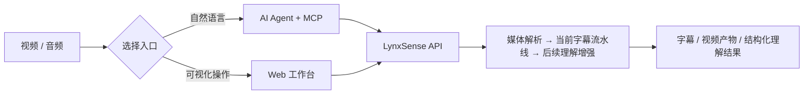

[English](./README.en.md) | 简体中文

<div align="center">
  
  <h1>LynxSense</h1>
  <p><strong>像猞猁一样敏锐，感知媒体里的每一个信号。</strong></p>
  <p>从字幕到分类、情绪与语调，把视频和音频中的信号提取成可理解、可检索、可供 AI 使用的信息。</p>

  <p>
    <a href="#-快速开始">快速开始</a> ·
    <a href="#-产品方向">产品方向</a> ·
    <a href="#-mcp-接入">MCP 接入</a> ·
    <a href="#-web-工作台">Web 工作台</a> ·
    <a href="./docs/mcp-server.md">完整文档</a>
  </p>

  <p>
    
    
    
    
    
  </p>
</div>


LynxSense 是面向视频与音频的信息理解工作台。当前已交付的字幕流水线覆盖视频下载、音频提取、语音识别、字幕翻译与字幕烧录；它是理解媒体内容的起点，而不是终点。后续会把视频或音频中的文本、内容类别、情绪、语调和关键事件等信号转化为带时间轴与置信度的结构化结果，供人阅读、检索，也供大模型作为可靠上下文使用。

## 🎯 产品方向

LynxSense 的目标不是只生成一份字幕，而是把原始多媒体转化为可推理的内容表示：输入可以是视频或音频，输出既可以是字幕和成品视频，也可以是能被 AI Agent 或业务系统直接消费的结构化理解结果。

- **字幕与逐段文本**：保留时间轴、说话内容和可编辑字幕，作为可追溯的基础层。
- **内容分类与标签**：按可配置的分类体系识别主题、场景、人物或关键事件，帮助检索与下游路由。
- **声音表达理解**：识别情绪、语调、语速及其他声学表达信号，为文本之外的语义补充证据。
- **面向大模型的上下文**：以结构化字段、时间范围和置信度返回结果，让大模型能够定位、引用和组合多媒体信息，而非只接收一段长转写文本。

上述扩展能力属于产品方向，会随着实现逐步进入 Web 工作台、任务结果和 MCP 工具；README 会清楚区分已交付能力与规划中的能力。

## ✨ 两种使用方式

| | 🤖 MCP 接入 | 🖥️ Web 工作台 |
| --- | --- | --- |
| 适合谁 | 希望让 Codex、Claude Desktop 等 AI 客户端处理视频的用户 | 希望直接在浏览器中操作的用户 |
| 怎么使用 | 用自然语言让 Agent 创建、查询、重试媒体理解任务 | 粘贴 URL 或上传媒体，选择当前可用的处理参数 |
| 核心体验 | 工具可发现、状态可追踪、结构化结果可供 Agent 消费 | 任务队列、实时进度、预览、字幕编辑与结果下载 |
| 接入方式 | stdio 或 Streamable HTTP | 部署地址：直连 TCP `8000`，或 HTTPS 反向代理 |



## 🚀 快速开始

### Ubuntu / Debian 一键安装（推荐）

登录服务器后执行这一行即可：

```bash
curl -fsSL https://github.com/S-zhi/Subtitles-AI/releases/latest/download/install.sh | sudo bash
```

这个稳定地址始终下载最新正式版的 `install.sh`，脚本会安装与该 Release 对应的代码版本。

安装器会在终端中静默询问 Replicate 和 DeepSeek 密钥，并自动完成代码下载、FFmpeg、uv、Python 3.12、项目依赖、持久化目录、systemd 服务和健康检查。安装结束后打开 `http://服务器IP:8000/`。

```bash
systemctl status subtitles-ai --no-pager
journalctl -u subtitles-ai -f
```

脚本支持 Ubuntu/Debian，重复执行时留空密钥即可保留原值。公网访问前还需要在云平台安全组中放行 TCP 8000，生产环境建议改用 HTTPS 反向代理。参数、非交互安装和故障排查见 [Linux 部署文档](./docs/quick-start-linux.md)。

### macOS 本地运行

#### 1. 准备环境

当前已在 macOS 验证，需要 Python `3.10–3.12`、[uv](https://docs.astral.sh/uv/) 和带 `libass` 的 FFmpeg：

```bash
brew install uv
brew tap homebrew-ffmpeg/ffmpeg
brew install ffmpeg-full
uv sync
```

确认字幕滤镜可用：

```bash
ffmpeg -hide_banner -filters | grep " subtitles "
```

> 普通版 FFmpeg 可能不包含 `libass`，硬字幕会因此无法烧录；遇到该情况也可以选择软字幕模式。

#### 2. 配置密钥

```bash
cp .env.example .env
```

在 `.env` 中填写：

```ini
REPLICATE_API_TOKEN=your-replicate-token
SUBTRANS_DEEPSEEK_API_KEY=your-deepseek-key
```

密钥只由业务服务读取，不应写入 MCP 参数或提交到仓库。

#### 3. 配置 Google Drive（可选）

Google Drive sidecar 使用本地配置文件读取 OAuth 应用身份；该文件已被 Git 忽略，不会提交到仓库：

```bash
cp drive-service/config.example.json drive-service/config.local.json
```

然后在 `drive-service/config.local.json` 中填写 `google_client_id`、`google_client_secret`，或将 Google Desktop OAuth JSON 放到 `drive-service/drive-data/oauth_client.json`。首次使用时，在网页的 **Google Drive** 页面点击授权，浏览器会打开动态 loopback 回调；Refresh Token 会保存在本地 `drive-data` 目录。OAuth Client 必须是 Desktop app 类型；sidecar 默认只监听本机 `127.0.0.1:8787`，不支持固定回调地址，也不应把 OAuth JSON、Refresh Token 或 Client Secret 提交到 Git。

#### 4. 启动业务服务和 Drive sidecar

`./scripts/start.sh` 会同时启动 Python 业务服务和 Google Drive sidecar；只有使用 Google Drive 时才需要准备 `drive-service/config.local.json`。如果暂时不用云盘功能，可以只启动 API，避免启动 sidecar。

```bash
./scripts/start.sh
```

如果只需要业务 API（例如不使用 Google Drive），可单独启动：

```bash
uv run uvicorn src.handler.app:app --port 8000
```

如需指定其他 Drive 配置文件，可使用：

```bash
DRIVE_CONFIG=/absolute/path/to/config.local.json ./scripts/start.sh
```

验证服务：

```bash
curl http://127.0.0.1:8000/api/health
# {"ok":true}
curl http://127.0.0.1:8787/healthz
# {"ok":true}
```

现在可以选择以下任一路径：

- 想直接操作：访问已部署的 Web 地址；直连时使用 `http://<服务器IP>:8000/`，使用反向代理时访问配置好的 HTTPS 域名。
- 想让 AI Agent 操作：继续阅读 [MCP 接入](#-mcp-接入)。

### Google Drive 任务级同步

Google Drive 仅同步用户明确选择的文件或任务产物，不会自动同步全部本地资源，也不会按 Web 页面的保留策略自动清理云端文件。单文件上传支持可恢复分片；下载或导入会使用 `Range` 续传，完成后在可用时校验 Drive 提供的 MD5，再提交业务 API。

文件夹批量上传通过 manifest 建立任务级目录：路径必须是相对路径，批次和条目分别提供状态、进度、暂停/恢复、取消与失败重试；相同 `Idempotency-Key` 或 `X-Client-Request-ID` 可安全重试批次创建。以任务 ID 创建的目录通过元数据关联同一任务，重复请求不会重复创建目录。Drive 文件夹不能下载或导入 Python 流水线。

`drive-service/README.md` 列出了 sidecar API；真实 OAuth、云端传输和凭据测试不属于本地验证范围。

## 🤖 MCP 接入

MCP Server 是业务 API 的独立适配层。它不会直接访问 SQLite，也不会持有 Replicate 或 DeepSeek 密钥。

### stdio：接入桌面 AI 客户端

在 MCP 客户端配置中加入以下内容，并把 `/absolute/path/to/Subtitles-AI` 改为本仓库的绝对路径：

```json
{
  "mcpServers": {
    "subtitles-ai": {
      "command": "uv",
      "args": [
        "--directory",
        "/absolute/path/to/Subtitles-AI",
        "run",
        "python",
        "-m",
        "src.mcp_server.server"
      ],
      "env": {
        "SUBTRANS_API_BASE_URL": "http://127.0.0.1:8000"
      }
    }
  }
}
```

重启 MCP 客户端后，可以直接说：

> 检查字幕服务是否就绪，把这个视频翻译成中英双语字幕，使用软字幕，并在完成后给我下载地址：`<视频 URL>`

Agent 会按以下可追踪流程执行：

```text
check_subtitle_setup → probe_video → start_subtitle_pipeline
→ get_task_status（轮询）→ get_task_artifacts（成功后）
```

首次调用前，先确保业务 API 已启动并检查 `/api/health/ready`。`check_subtitle_setup` 会返回 `initialized`、`missing`、`config_file`、`agent_action` 和 `restart_required`：配置缺失时，按返回路径补齐业务服务项目根目录的 `.env`，重启 FastAPI 后再次检查；不要把业务密钥传入 MCP 参数。`start_subtitle_pipeline` 只表示任务已入队，必须保存 `task_id` 并轮询状态，不要提前读取产物。

任务进入 `FAILED` 时先向用户展示错误和阶段，只有用户确认后才调用 `retry_task`。如果返回 `TASK_ALREADY_RUNNING`，复用返回的 `task_id`；只有状态为 `SUCCESS` 时才调用 `get_task_artifacts`。`RESOURCE_MISSING` 表示产物已被清理，需要重新运行任务；`HARD_BURN_UNAVAILABLE` 时应询问用户改用 `burn=soft` 或安装带 libass 的 FFmpeg，不能静默改变明确指定的硬字幕选项。

`start_subtitle_pipeline` 的默认参数为 `source_lang=auto`、`target_lang=zh-CN`、`mode=mono`、`burn=hard`、`model=small` 和 `need_subtitle=true`。支持的主要错误码包括 `BUSINESS_UNAVAILABLE`、`NOT_INITIALIZED`、`INVALID_URL`、`PROBE_FAILED`、`INVALID_ARGUMENT`、`TASK_NOT_READY`、`TASK_NOT_FOUND` 和 `RESOURCE_MISSING`。

### Streamable HTTP：接入远程或共享 Host

```bash
SUBTRANS_MCP_TRANSPORT=streamable-http \
  uv run python -m src.mcp_server.server
```

默认 MCP 地址：`http://127.0.0.1:3001/mcp`。

### MCP 能力一览

| 工具 | 用途 |
| --- | --- |
| `check_subtitle_setup` | 检查业务服务、密钥、FFmpeg 与存储是否就绪 |
| `probe_video` | 在下载前验证视频 URL |
| `start_subtitle_pipeline` | 异步创建下载 / 识别 / 翻译 / 烧录任务 |
| `get_task_status` | 查询阶段、进度与错误信息 |
| `get_task_artifacts` | 获取成功任务的视频与字幕地址 |
| `list_tasks` | 查看最近任务 |
| `retry_task` | 经用户确认后重试失败任务 |

完整配置、错误码和 Agent 行为规范见 [MCP Server 文档](./docs/mcp-server.md) 与 [MCP Agent 指南](./docs/mcp-agent-guide.md)。

## 🖥️ Web 工作台

Web 工作台与业务 API 共用 `8000` 端口，无需单独启动前端服务。部署时，如果选择直连访问，让业务服务监听 `0.0.0.0:8000`，并在云平台安全组和服务器防火墙中放行 TCP `8000`；用户通过 `http://<服务器公网IP>:8000/` 访问。生产环境更建议让业务服务仅监听 `127.0.0.1:8000`，由 Nginx 或 Caddy 对外暴露 `80/443` 和 HTTPS。

启用 Google Drive 时，页面通过 CORS 访问同机的 `8787` sidecar。它只是本机 Drive 适配层，不是业务 API；保持 `127.0.0.1:8787`，不要在安全组或防火墙中向公网暴露该端口。

1. 访问部署后的 Web 地址：直连场景使用 `http://<服务器公网IP>:8000/`，反向代理场景使用 HTTPS 域名。
2. 粘贴视频页面地址，或拖入本地视频。
3. 选择源语言、目标语言、仅译文 / 双语字幕、硬烧录 / 软字幕和识别模型。
4. 点击「开始处理」，在任务队列中查看实时进度。
5. 完成后预览视频、编辑字幕，并下载视频或 SRT 文件。

主要能力：

- **任务中心**：当前字幕任务的批量队列、实时阶段与失败重试；后续媒体理解任务会复用同一任务模型。
- **视频预览**：在浏览器中直接检查最终效果。
- **字幕编辑**：查看并调整识别或翻译后的字幕。
- **本地资源**：查看磁盘占用、保留策略和清理预览；默认保留产物 30 天，自动清理只删除产物并保留任务记录。
- **灵活输出**：当前支持视频、单语 / 双语字幕、硬烧录 / 软字幕；后续会增加面向大模型的结构化理解结果。

## 🧩 无页面使用

仓库当前没有独立的 `main.py` 命令行入口。不打开 Web 页面时，请启动 API，并通过 MCP 客户端调用 `start_subtitle_pipeline`；完整的 stdio 配置和调用顺序见上方 [MCP 接入](#-mcp-接入)。

## 🏗️ 当前字幕工作流

下图描述已交付的字幕处理链路；分类、声音表达和其他理解增强会在后续以独立阶段接入。


任务状态：

```text
PENDING → DOWNLOADING → EXTRACTING → TRANSCRIBING
→ TRANSLATING → BURNING → SUCCESS
```

任一步失败会进入 `FAILED`，并保存失败阶段与错误信息。任务产物默认位于 `data/{task_id}/`。

## ⚙️ 常用配置

| 变量 | 默认值 | 说明 |
| --- | --- | --- |
| `SUBTRANS_DATA_DIR` | `./data` | 任务产物目录 |
| `SUBTRANS_DB` | `./app.db` | SQLite 数据库路径 |
| `SUBTRANS_WORKERS` | `8` | 整条后台流水线的并发上限（应高于下载并发） |
| `SUBTRANS_DOWNLOAD_WORKERS` | `2` | 同时进行 yt-dlp 媒体下载的任务数 |
| `SUBTRANS_DL_CONCURRENT_FRAGMENTS` | `4` | 单个 HLS/DASH 下载的分片并发数 |
| `SUBTRANS_COOKIES` | 空 | 需要登录或验证的网站 cookies 文件 |
| `SUBTRANS_WHISPER_MODEL` | 锁定版本 | Replicate Whisper 模型 |
| `SUBTRANS_DEEPSEEK_MODEL` | `deepseek-chat` | 翻译模型 |
| `SUBTRANS_API_BASE_URL` | `http://127.0.0.1:8000` | MCP 访问的业务 API 地址 |
| `SUBTRANS_MCP_TRANSPORT` | `stdio` | `stdio` 或 `streamable-http` |
| `SUBTRANS_MCP_HOST` | `127.0.0.1` | Streamable HTTP 监听地址 |
| `SUBTRANS_MCP_PORT` | `3001` | Streamable HTTP 监听端口 |
| `SUBTRANS_MCP_PATH` | `/mcp` | Streamable HTTP 路径 |

完整配置项见 [.env.example](./.env.example) 与 [mcp.env.example](./mcp.env.example)。启动后，直连部署可访问 `http://<服务器公网IP>:8000/docs`，反向代理部署则访问 `https://<你的域名>/docs` 查看 API 文档。

## 🧪 开发与验证

```bash
uv sync
uv run pytest -q
cd web && npm test
```

项目主要目录：

```text
install.sh         Linux 一键安装与 systemd 配置
src/core/          下载、音频、识别、翻译与字幕烧录
src/handler/       FastAPI 路由与前端静态托管
src/mcp_server/    MCP Server、工具与业务 API 客户端
src/service/       流水线编排与后台执行
src/store/         SQLite 任务存储
web/               原生 HTML / CSS / JavaScript 工作台
tests/             Python 测试
```

参与开发前请阅读 [CONTRIBUTING.md](./CONTRIBUTING.md)。安全问题请通过 [SECURITY.md](./SECURITY.md) 中的私密渠道报告，不要创建公开 Issue。

## ❓ 常见问题

| 问题 | 处理方式 |
| --- | --- |
| 硬字幕提示缺少 `subtitles` filter | 安装 `ffmpeg-full`，或改用 `--burn soft` |
| 下载失败或网站要求登录 | 检查 URL，并通过 `SUBTRANS_COOKIES` 指定 cookies 文件 |
| MCP 返回 `BUSINESS_UNAVAILABLE` | 启动业务 API（`./scripts/start.sh` 或 API-only 命令），确认 8000 端口可访问；使用 Google Drive 时再确认 8787 端口 |
| MCP 返回 `NOT_INITIALIZED` | 补齐 `.env` 中的密钥并重启业务服务 |
| 前端无法连接后端 | 在服务器上运行 `curl http://127.0.0.1:8000/api/health`，并检查 TCP `8000` 的监听、云安全组和防火墙；使用反向代理时再检查上游配置 |
| Google Drive 页面显示 sidecar 离线 | 确认已按配置启动 sidecar，并检查 <http://127.0.0.1:8787/healthz>；只启动 API-only 命令不会提供 Drive 功能 |

## 📄 许可证与合规

本项目基于 [MIT License](./LICENSE) 发布。

请仅处理你有权访问、下载、转写、翻译和再发布的视频，并遵守目标网站服务条款、版权限制及所在地法律。
