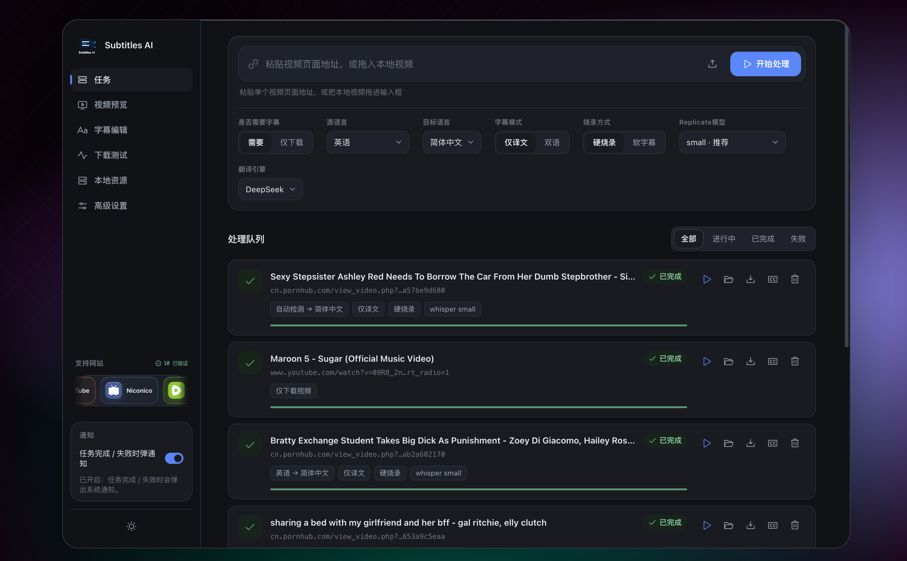
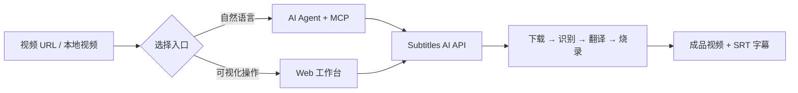
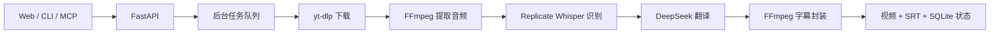

[English](./README.en.md) | 简体中文

<div align="center">
  
  <h1>Subtitles AI</h1>
  <p><strong>把任意视频变成可理解、可翻译、可交付的字幕成片。</strong></p>
  <p>既是开箱即用的可视化字幕工作台，也是可被 AI Agent 调用的 MCP 字幕能力。</p>

  <p>
    <a href="#-快速开始">快速开始</a> ·
    <a href="#-mcp-接入">MCP 接入</a> ·
    <a href="#-web-工作台">Web 工作台</a> ·
    <a href="./docs/mcp-server.md">完整文档</a>
  </p>

  <p>
    
    
    
    
    
  </p>
</div>



Subtitles AI 将视频下载、音频提取、语音识别、字幕翻译与字幕烧录串成一条自动化流水线。粘贴视频页面地址或拖入本地视频，即可获得翻译后的 SRT 与成品视频；也可以把同一套能力接入支持 MCP 的 AI 客户端，让 Agent 自主检查环境、创建任务、跟踪进度并交付产物。

## ✨ 两种使用方式

| | 🤖 MCP 接入 | 🖥️ Web 工作台 |
| --- | --- | --- |
| 适合谁 | 希望让 Codex、Claude Desktop 等 AI 客户端处理视频的用户 | 希望直接在浏览器中操作的用户 |
| 怎么使用 | 用自然语言让 Agent 创建、查询、重试字幕任务 | 粘贴 URL 或拖入视频，选择语言与字幕参数 |
| 核心体验 | 工具可发现、状态可追踪、结果结构化返回 | 任务队列、实时进度、视频预览、字幕编辑与下载 |
| 接入方式 | stdio 或 Streamable HTTP | 本地打开 `http://localhost:8000` |



## 🚀 快速开始

### 1. 准备环境

当前已在 macOS 验证，需要 Python `3.10–3.12`、[uv](https://docs.astral.sh/uv/) 和带 `libass` 的 FFmpeg：

```bash
brew install uv
brew tap homebrew-ffmpeg/ffmpeg
brew install ffmpeg-full
uv sync
```

确认字幕滤镜可用：

```bash
ffmpeg -hide_banner -filters | grep " subtitles "
```

> 普通版 FFmpeg 可能不包含 `libass`，硬字幕会因此无法烧录；遇到该情况也可以选择软字幕模式。

### 2. 配置密钥

```bash
cp .env.example .env
```

在 `.env` 中填写：

```ini
REPLICATE_API_TOKEN=your-replicate-token
SUBTRANS_DEEPSEEK_API_KEY=your-deepseek-key
```

密钥只由业务服务读取，不应写入 MCP 参数或提交到仓库。

### 3. 配置 Google Drive（需要云盘功能时）

Google Drive sidecar 使用本地配置文件读取 OAuth 应用身份；该文件已被 Git 忽略，不会提交到仓库：

```bash
cp drive-service/config.example.json drive-service/config.local.json
```

然后在 `drive-service/config.local.json` 中填写 `google_client_id`、`google_client_secret`，或将 Google Desktop OAuth JSON 放到 `drive-service/drive-data/oauth_client.json`。首次使用时，在网页的 **Google Drive** 页面点击授权，浏览器会打开动态 loopback 回调；Refresh Token 会保存在本地 `drive-data` 目录。

### 4. 启动业务服务和 Drive sidecar

```bash
./scripts/start.sh
```

如需指定其他 Drive 配置文件，可使用：

```bash
DRIVE_CONFIG=/absolute/path/to/config.local.json ./scripts/start.sh
```

验证服务：

```bash
curl http://127.0.0.1:8000/api/health
# {"ok":true}
curl http://127.0.0.1:8787/healthz
# {"ok":true}
```

现在可以选择以下任一路径：

- 想直接操作：打开 <http://localhost:8000/>。
- 想让 AI Agent 操作：继续阅读 [MCP 接入](#-mcp-接入)。

## 🤖 MCP 接入

MCP Server 是业务 API 的独立适配层。它不会直接访问 SQLite，也不会持有 Replicate 或 DeepSeek 密钥。

### stdio：接入桌面 AI 客户端

在 MCP 客户端配置中加入以下内容，并把 `/absolute/path/to/Subtitles-AI` 改为本仓库的绝对路径：

```json
{
  "mcpServers": {
    "subtitles-ai": {
      "command": "uv",
      "args": [
        "--directory",
        "/absolute/path/to/Subtitles-AI",
        "run",
        "python",
        "-m",
        "src.mcp_server.server"
      ],
      "env": {
        "SUBTRANS_API_BASE_URL": "http://127.0.0.1:8000"
      }
    }
  }
}
```

重启 MCP 客户端后，可以直接说：

> 检查字幕服务是否就绪，把这个视频翻译成中英双语字幕，使用软字幕，并在完成后给我下载地址：`<视频 URL>`

Agent 会按以下可追踪流程执行：

```text
check_subtitle_setup → probe_video → start_subtitle_pipeline
→ get_task_status（轮询）→ get_task_artifacts（成功后）
```

### Streamable HTTP：接入远程或共享 Host

```bash
SUBTRANS_MCP_TRANSPORT=streamable-http \
  uv run python -m src.mcp_server.server
```

默认 MCP 地址：`http://127.0.0.1:3001/mcp`。

### MCP 能力一览

| 工具 | 用途 |
| --- | --- |
| `check_subtitle_setup` | 检查业务服务、密钥、FFmpeg 与存储是否就绪 |
| `probe_video` | 在下载前验证视频 URL |
| `start_subtitle_pipeline` | 异步创建下载 / 识别 / 翻译 / 烧录任务 |
| `get_task_status` | 查询阶段、进度与错误信息 |
| `get_task_artifacts` | 获取成功任务的视频与字幕地址 |
| `list_tasks` | 查看最近任务 |
| `retry_task` | 经用户确认后重试失败任务 |

完整配置、错误码和 Agent 行为规范见 [MCP Server 文档](./docs/mcp-server.md) 与 [MCP Agent 指南](./docs/mcp-agent-guide.md)。

## 🖥️ Web 工作台

Web 工作台与 API 共用 `8000` 端口，无需单独启动前端服务；Google Drive 页面会通过 CORS 访问同机的 `8787` sidecar。

1. 打开 <http://localhost:8000/>。
2. 粘贴视频页面地址，或拖入本地视频。
3. 选择源语言、目标语言、仅译文 / 双语字幕、硬烧录 / 软字幕和识别模型。
4. 点击「开始处理」，在任务队列中查看实时进度。
5. 完成后预览视频、编辑字幕，并下载视频或 SRT 文件。

主要能力：

- **任务中心**：批量任务队列、实时阶段与失败重试。
- **视频预览**：在浏览器中直接检查最终效果。
- **字幕编辑**：查看并调整识别或翻译后的字幕。
- **本地资源**：查看磁盘占用、保留策略和清理预览；默认保留产物 30 天，自动清理只删除产物并保留任务记录。
- **灵活输出**：仅下载视频、单语 / 双语字幕、硬烧录 / 软字幕。

## 🧩 命令行使用

不启动 Web 页面也可以直接运行完整流水线：

```bash
uv run python main.py "<视频 URL>"
uv run python main.py "<视频 URL>" \
  --target zh-CN --source auto --mode bilingual --burn soft --model small
```

| 参数 | 默认值 | 说明 |
| --- | --- | --- |
| `url` | 必填 | 视频页面地址 |
| `--target` | `zh-CN` | 目标语言 |
| `--source` | `auto` | 源语言，默认自动检测 |
| `--mode` | `mono` | `mono` 仅译文，`bilingual` 双语 |
| `--burn` | `hard` | `hard` 硬字幕，`soft` 软字幕 |
| `--model` | `small` | Whisper 模型权重 |

## 🏗️ 工作原理



任务状态：

```text
PENDING → DOWNLOADING → EXTRACTING → TRANSCRIBING
→ TRANSLATING → BURNING → SUCCESS
```

任一步失败会进入 `FAILED`，并保存失败阶段与错误信息。任务产物默认位于 `data/{task_id}/`。

## ⚙️ 常用配置

| 变量 | 默认值 | 说明 |
| --- | --- | --- |
| `SUBTRANS_DATA_DIR` | `./data` | 任务产物目录 |
| `SUBTRANS_DB` | `./app.db` | SQLite 数据库路径 |
| `SUBTRANS_WORKERS` | `8` | 整条后台流水线的并发上限（应高于下载并发） |
| `SUBTRANS_DOWNLOAD_WORKERS` | `2` | 同时进行 yt-dlp 媒体下载的任务数 |
| `SUBTRANS_DL_CONCURRENT_FRAGMENTS` | `4` | 单个 HLS/DASH 下载的分片并发数 |
| `SUBTRANS_COOKIES` | 空 | 需要登录或验证的网站 cookies 文件 |
| `SUBTRANS_WHISPER_MODEL` | 锁定版本 | Replicate Whisper 模型 |
| `SUBTRANS_DEEPSEEK_MODEL` | `deepseek-chat` | 翻译模型 |
| `SUBTRANS_API_BASE_URL` | `http://127.0.0.1:8000` | MCP 访问的业务 API 地址 |
| `SUBTRANS_MCP_TRANSPORT` | `stdio` | `stdio` 或 `streamable-http` |

完整配置项见 [.env.example](./.env.example) 与 [mcp.env.example](./mcp.env.example)。启动后可访问 <http://localhost:8000/docs> 查看 API 文档。

## 🧪 开发与验证

```bash
uv sync
uv run pytest -q
cd web && npm test
```

项目主要目录：

```text
src/core/          下载、音频、识别、翻译与字幕烧录
src/handler/       FastAPI 路由与前端静态托管
src/mcp_server/    MCP Server、工具与业务 API 客户端
src/service/       流水线编排与后台执行
src/store/         SQLite 任务存储
web/               原生 HTML / CSS / JavaScript 工作台
tests/             Python 测试
```

参与开发前请阅读 [CONTRIBUTING.md](./CONTRIBUTING.md)。安全问题请通过 [SECURITY.md](./SECURITY.md) 中的私密渠道报告，不要创建公开 Issue。

## ❓ 常见问题

| 问题 | 处理方式 |
| --- | --- |
| 硬字幕提示缺少 `subtitles` filter | 安装 `ffmpeg-full`，或改用 `--burn soft` |
| 下载失败或网站要求登录 | 检查 URL，并通过 `SUBTRANS_COOKIES` 指定 cookies 文件 |
| MCP 返回 `BUSINESS_UNAVAILABLE` | 先运行 `./scripts/start.sh`，确认 8000 和 8787 端口都已启动 |
| MCP 返回 `NOT_INITIALIZED` | 补齐 `.env` 中的密钥并重启业务服务 |
| 前端无法连接后端 | 确认 <http://localhost:8000/api/health> 可访问 |
| Google Drive 页面显示 sidecar 离线 | 确认 `./scripts/start.sh` 已启动，并检查 <http://127.0.0.1:8787/healthz> |

## 📄 许可证与合规

本项目基于 [MIT License](./LICENSE) 发布。

请仅处理你有权访问、下载、转写、翻译和再发布的视频，并遵守目标网站服务条款、版权限制及所在地法律。
