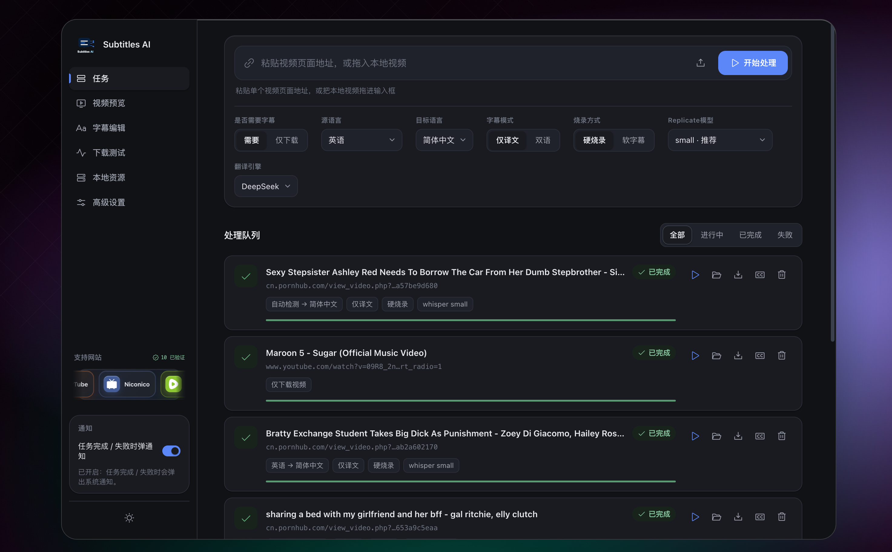

[English](./docs/en/README.md) | 简体中文

<div align="center">
  
  <h1>LynxSense</h1>
  <p><strong>像猞猁一样敏锐，感知媒体里的每一个信号。</strong></p>
  <p>从字幕到分类、情绪与语调，把视频和音频中的信号提取成可理解、可检索、可供 AI 使用的信息。</p>
</div>



LynxSense 是面向视频与音频的信息理解工作台。当前已交付字幕下载、语音识别、翻译、字幕封装和 Web 工作台；分类、声音表达和面向大模型的结构化理解能力会逐步扩展。

## Docker 快速启动

在仓库根目录执行：

```bash
cp .env.example .env
# 在 .env 中填写 SUBTRANS_DEEPSEEK_API_KEY
docker build -t lynxsense:local . && docker run -d --name lynxsense --restart unless-stopped -p 8000:8000 --env-file .env -e SUBTRANS_DATA_DIR=/data -e SUBTRANS_DB=/data/db/app.db -v lynxsense-data:/data lynxsense:local
```

打开 <http://localhost:8000/>。本地开发、Linux 部署和容器升级说明见[文档目录](./docs/README.md)。

## 能力概览

- **字幕流水线**：下载视频、提取音频、语音识别、翻译，并生成软字幕或硬字幕成品，解决视频内容快速理解和跨语言观看问题。
- **Web 工作台**：提供任务队列、实时进度、视频预览、字幕编辑和结果下载，适合直接在浏览器中处理媒体。
- **MCP 接入**：让 Codex、Claude Desktop 等 AI 客户端通过自然语言创建和跟踪处理任务，适合把媒体处理接入 Agent 工作流。
- **Google Drive 扩展**：按任务上传、下载和管理云端文件，适合将处理结果接入团队文件流转。
- **可替换转写后端**：支持本地 faster-whisper、Replicate 和兼容 HTTP 服务，适合在成本、速度、隐私之间选择。
- **媒体理解扩展方向**：将内容分类、情绪、语调和关键事件转为带时间轴与置信度的结构化结果，供检索和 AI 使用。

## 文档

- [文档目录](./docs/README.md)：按场景查找部署和扩展说明
- [本地快速启动](./docs/local-quick-start.md)：macOS/Linux 本地运行、环境变量和 Google Drive sidecar
- [Linux 部署](./docs/quick-start-linux.md)：Ubuntu/Debian 一键安装、systemd、反向代理和排障
- [MCP Server](./docs/mcp-server.md)：stdio、Streamable HTTP 和工具说明
- [MCP Agent 指南](./docs/mcp-agent-guide.md)：Agent 调用顺序、状态处理和错误处理
- [转写服务协议](./docs/transcriber-service.md)：本地、Replicate 和 HTTP 转写后端
- [Google Drive sidecar](./drive-service/README.md)：云端文件同步 API 与配置

## 开发

项目使用 Python、FastAPI、FFmpeg 和原生 Web 前端。开发规范见 [CONTRIBUTING.md](./.github/CONTRIBUTING.md)，安全问题请通过 [SECURITY.md](./.github/SECURITY.md) 私下报告。

## 许可证与合规

本项目基于 [MIT License](./LICENSE) 发布。请仅处理你有权访问、下载、转写、翻译和再发布的内容，并遵守目标网站条款、版权限制及所在地法律。
